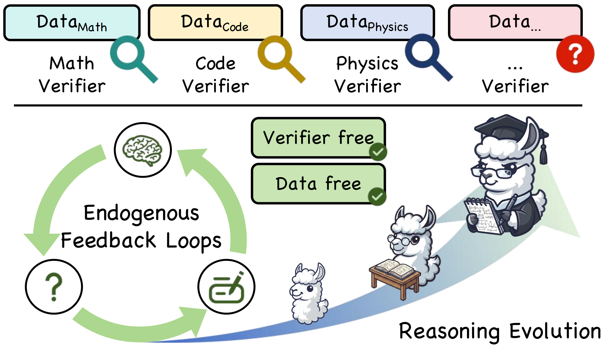

# AERO: Autonomous Evolutionary Reasoning Optimization via Endogenous Dual-Loop Feedback

<p align="center">
Repo for "<a href="" target="_blank">AERO: Autonomous Evolutionary Reasoning Optimization via Endogenous Dual-Loop Feedback</a>"
</p>

<p align="center">
  
</p>

## 🔥News

- [2026/02/03] 🔥🔥🔥 AERO anonymous repo is released!

## 📊 Results

AERO achieves superior performance for data-free self-evolution:

- **Performance Gain**: Average improvements of **4.57%** on Qwen3-4B-Base and **5.10%** on Qwen3-8B-Base  across nine benchmarks.
- **Domain Success**: Significant growth in Mathematical (avg **+7.2%** for 8B) and Physical reasoning.
- **Continuous Growth**: Reasoning capabilities **evolve steadily** through each training round (R1 to R5), reaching peak performance almost in the final iteration.

## 🔬 Project Structure

```bash
AERO/
├── .gitignore
├── README.md               # Project documentation and framework overview
├── config.yaml             # Global configuration
├── requirements.txt        # Python dependencies
│
├── local_model/
│   └── local_model_interface.py    # Interface for vLLM/local model inference
│
├── pipeline/
│   └── run_aero_pipeline.py        # Main dual-loop evolution script
│
├── synth/
│   ├── answer_analyzer.py          # Entropy calculation & ZPD positioning logic
│   ├── answerer.py                 # Solver & Refiner role prompts and logic
│   ├── generator.py                # Task generation (Self-Questioning) logic
│   ├── inner_loop.py               # Experience synthesis & ICC verification
│   └── prompt_template.txt         # Generator prompt
│
├── train/
│   └── run_pipeline.sh             # Entry point shell script for training
│
└── utils/
    ├── io.py                       # JSONL reading/writing utilities
    └── make_kto_data.py            # Utility for KTO data formatting
```


## 🚀 Quick Start

Follow these steps to set up the environment and initiate the autonomous reasoning evolution process.

### Installation 🛠️

First, clone the repository and install the necessary dependencies. AERO requires [LLaMA-Factory](https://github.com/hiyouga/LlamaFactory) for policy optimization and [vLLM](https://github.com/vllm-project/vllm) for high-throughput inference.

```bash
# Clone the repository
git clone git clone https://github.com/mira-ai-lab/AERO.git
cd AERO

# Install core dependencies
pip install -r requirements.txt

# Ensure LLaMA-Factory is properly linked
# The pipeline expects LLaMA-Factory to be in the directory specified in config.yaml
git clone https://github.com/hiyouga/LLaMA-Factory.git
cd LLaMA-Factory
pip install -e .
cd ..
```

### Configuration ⚙️

Before starting, update the `config.yaml` file to match your local environment. This file controls the evolution dynamics and directory paths.

- **`init_model_path`**: The local path to your base model (e.g., Qwen2.5-7B-Instruct).
- **`llama_factory_dir`**: The relative or absolute path to your LLaMA-Factory installation.
- **`questions_per_round`**: Set the number of tasks ($m$) to generate per iteration (default: 1000).
- **`sampling_n`**: Set the number of trajectories ($n$) sampled for entropy calculation (default: 16).

### Starting the Evolution Pipeline 🚀

AERO utilizes a dual-loop system where the model self-evolves through iterative experience synthesis and policy updates.

To launch the automated pipeline, use the `train/run_pipeline.sh` script. This script manages vLLM instance deployment, the inner-loop self-play sandbox, and outer-loop KTO training.

```bash
# Usage: bash train/run_pipeline.sh {EXP_NAME} {PORT} {GPUS} {CONFIG_PATH}

# Example: Run an experiment named 'aero_qwen_7b' on GPUs 0 and 1, starting at port 8001
bash train/run_pipeline.sh aero_qwen_7b 8001 "0,1" config.yaml
```

## 📜 Citation

If you find AERO useful in your research, please cite our work:

```
@article{aero2026,
  title={AERO: Autonomous Evolutionary Reasoning Optimization via Endogenous Dual-Loop Feedback},
  author={Anonymous Authors},
  journal={Under review},
  year={2026}
}
```
